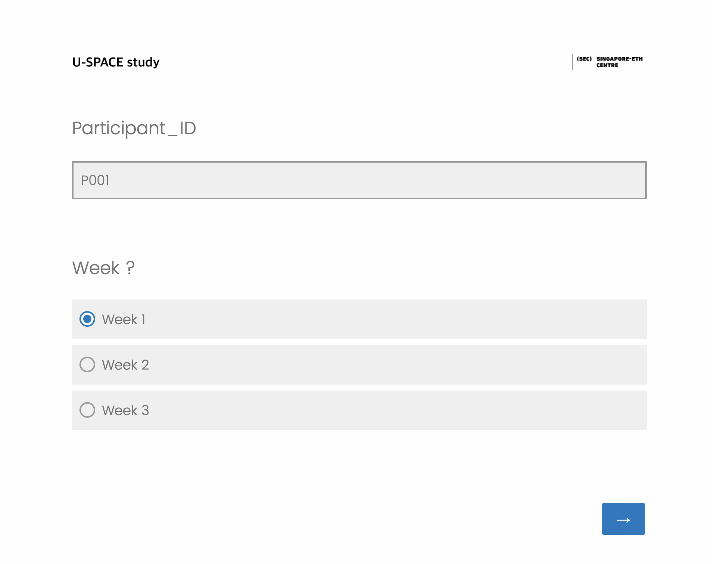
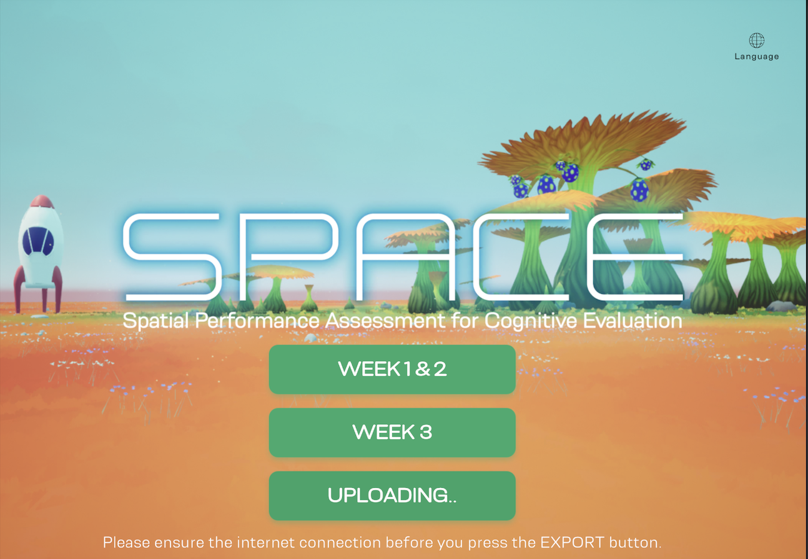

# mini-SPACE-Experiment-Instructions-At home

## Instructions for Weeks 1 and 2

Please carefully follow the steps below for each week's gameplay:

### 1. Starting the Game:
- Tap the button labeled **[Week 1 & 2]** to enter the game.

### 2. Participant ID Input:
- Enter your Participant ID in the following format:
  - **Week 1:** `PXXX_1` (e.g., `P001_1`)
  - **Week 2:** `PXXX_2` (e.g., `P001_2`)

### 3. Gameplay:
- Play the game until you reach the final **Done** button.
- After pressing **Done**, you will be returned to the main screen.

### 4. Exporting Your Data: [!!!Ensure your internet connectivity of your iPAD when hit this button!!!]
- On the main screen, tap the **EXPORT** button. You will found the button turns into a **Uploading...** Status. 
- A pop-up message will appear:
  - If you see **"Export successful"**, your data has been successfully recorded!
  - If you see **"Export failed"**, please send an email to **nana.tian@sec.ethz.ch** with your participant number as the email subject. We will provide further instructions for your next steps.

---

### 5. Finish the questionnaire with the link below:
https://secfht.qualtrics.com/jfe/form/SV_9SRH9IYsAv0gtCK

For each week, you have to choose your week number properly. (For example, Week 1 you choose 1. Week 2 you choose 2. Week 3 you choose 3.)

[!!! After you complete the first week's questionnaire, you have to refresh the link in your web browser to start a new one!!!]

## Week 3 Access

After completing Week 1 and Week 2, the **[Week 3]** button will automatically appear when you return to the main screen.

---

## Instructions for Week 3

### 1. Starting the Game:
- Tap the button labeled **[Week 3]** to enter the game.

### 2. Participant ID Input:
- Enter your Participant ID in the following format:
  - **Week 3:** `PXXX_3` (e.g., `P001_3`)

### 3. Gameplay:
- Play the game until you reach the final **Done** button.
- After pressing **Done**, you will be returned to the main screen.

### 4. Exporting Your Data:
- On the main screen, tap the **EXPORT** button.
- A pop-up message will appear:
  - If you see **"Export successful"**, your data has been successfully recorded and sent to us!
  - If you see **"Export failed"**, please send an email to **nana.tian@sec.ethz.ch** with your participant number as the email subject. We will provide further instructions for your next steps.

### 5. Again, Finish the questionnaire with the link below:
https://secfht.qualtrics.com/jfe/form/SV_9SRH9IYsAv0gtCK

For each week, you have to choose your week number properly. (For example, Week 1 you choose 1. Week 2 you choose 2. Week 3 you choose 3.)

[!!! After you complete the first week's questionnaire, you have to refresh the link in your web browser to start a new one!!!]
